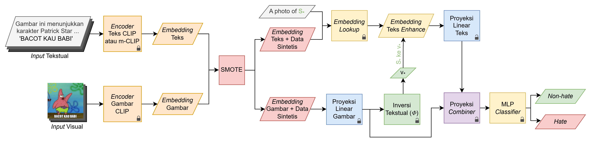

# ISSUES (ICCVW 2023)

### Mapping Memes to Words for Multimodal Hateful Meme Classification

[](http://arxiv.org/abs/2310.08368)
[](https://github.com/miccunifi/ISSUES)

[](https://paperswithcode.com/sota/hateful-meme-classification-on-harmeme?p=mapping-memes-to-words-for-multimodal-hateful)\
[](https://paperswithcode.com/sota/meme-classification-on-hateful-memes?p=mapping-memes-to-words-for-multimodal-hateful)

This repository is **adapted from the original ISSUES** implementation introduced in the [paper](https://openaccess.thecvf.com/content/ICCV2023W/CLVL/html/Burbi_Mapping_Memes_to_Words_for_Multimodal_Hateful_Meme_Classification_ICCVW_2023_paper.html) "*Mapp**I**ng Meme**S** to Word**S** for M**U**ltimodal Hateful M**E**me Cla**S**sification*" (**ISSUES**). 
The code is reused as a foundation for thesis project with additional experiments.

### Thesis Adaptation Note

This repository is adapted from the original ISSUES research code for a thesis study focused on an Indonesian-language meme dataset named IDmeme. 
The goal of this adaptation is to find out how the ISSUES pipeline performs in an Indonesian context, while extending the experimental setup with two additional components:

- **SMOTE** to balancing the training data distribution in the embedding space, and
- **M-CLIP XLM RoBERTa-Large** as an alternative text encoder to compare its effect against the original **CLIP ViT-L/14** text encoder.

This adaptation is intended for academic reuse and studying the impact of class imbalance handling and multilingual text representation on multimodal hateful meme classification.

## Overview

### Abstract

This thesis adapts the ISSUES architecture for Indonesian hateful meme classification on the IDmeme dataset. 
The study focuses on how the original multimodal pipeline performs in an Indonesian-language setting, where class imbalance and language-specific representation remain critical challenges.

To address this, the adaptation incorporates SMOTE for class balancing and compares two text encoders: the original CLIP ViT-L/14 and M-CLIP XLM-RoBERTa-Large. 
The experimental results show that the best configuration using SMOTE and CLIP ViT-L/14 achieves strong performance, while M-CLIP shows signs of overfitting under the current setup.



The adapted design follows the core ISSUES workflow: CLIP embeddings are projected into a shared latent space, while the textual inversion component is implemented using the [SEARLE](https://github.com/miccunifi/SEARLE) network to enrich the text representation before multimodal fusion through a [Combiner](https://github.com/ABaldrati/CLIP4Cir) module.

<details>
<summary><h2>Getting Started</h2></summary>

We recommend using the [**Anaconda**](https://www.anaconda.com/) package manager to avoid dependency/reproducibility problems.
For Linux systems, you can find a conda installation guide [here](https://docs.conda.io/projects/conda/en/latest/user-guide/install/linux.html).
Please note that this code has been adapted for Windows, so it will require some modifications before it can be used on a Linux system.
If you want to make further adaptations, we recommend using PyCharm to make the process easier.

### Installation

1. Clone the repository

```sh
git clone https://github.com/monicavierin/ISSUES
```

2. Install Python dependencies

Navigate to the root folder of the repository and use the command:
```sh
conda config --add channels conda-forge
conda create -n issues -y python=3.9.16
conda activate issues
conda install pytorch==1.12.1 torchvision==0.13.1 torchaudio==0.12.1 cudatoolkit=11.3 -c pytorch
conda install --file requirements.txt
pip install git+https://github.com/openai/CLIP.git
```

3. Log in to your WandB account
```sh
wandb login
```

## Datasets
We do not hold rights to the original HMC, HarMeme, and IDmeme datasets. 
To download the full original datasets use the following links:

- HMC **[[link](https://hatefulmemeschallenge.com/)]** - Contains **12.140** memes
- HarMeme **[[link](https://github.com/di-dimitrov/mmf/tree/master/data/datasets/memes/defaults/images)]** - Contains **3.544** memes
- IDmeme **[[link](https://huggingface.co/datasets/wittalistiyaningrum/corpus-image-meme-indonesia)]** - Contains **3.322** memes

### Data Preparation
Download the files in the [release](https://github.com/miccunifi/ISSUES/releases/tag/latest) for HMC and HarMeme datasets; [drive](https://drive.google.com/drive/folders/1Sa56Sme2BPlNydonJlQDPRfn30LzGEP7) for IDmeme dataset. Then, place the `resources` folder in the root folder:

<pre>
project_base_path
└─── <b>resources</b>
  ...
└─── src
  | combiner.py
  | datasets.py
  | engine.py
  ...

...
</pre>

Ensure the HMC, HarMeme, and IDmeme datasets match the following structure:

<pre>
project_base_path
└─── resources
  └─── datasets
    └─── harmeme
      └─── clip_embds
          | test_no-proj_output.pt
          | train_no-proj_output.pt
          | val_no-proj_output.pt

      └─── <b>img
          | covid_memes_2.png
          | covid_memes_3.png
          | covid_memes_4.png
          ....</b>

      └─── labels
          | info.csv

    └─── hmc
      └─── clip_embds
          | dev_seen_no-proj_output.pt
          | dev_unseen_no-proj_output.pt
          | test_seen_no-proj_output.pt
          | test_unseen_no-proj_output.pt
          | train_no-proj_output.pt

      └─── <b>img
          | 01235.png
          | 01236.png
          | 01243.png
          ....</b>
        
      └─── labels
          | info.csv
      
    └─── idmeme
      └─── clip_embds
          | test_no-proj_output.pt
          | test_no-proj_output_mclip.pt
          | train_no-proj_output.pt
          | train_no-proj_output_mclip.pt
          | val_no-proj_output.pt
          | val_no-proj_output_mclip.pt

      └─── <b>img
          | 0ad2cf39f744a184bdc7d3117cbae922.jpg
          | 0bcbc393ef2e7c336f46f43d878307c3.jpg
          | 0bcfee39-7b83-41c4-8cbd-273699148189-1675099361912.jpg
          ....</b>
        
      └─── labels
          | info.csv
  ...
  
└─── src
  | combiner.py
  | datasets.py
  | engine.py
  ...

...
</pre>

</details>

<details>
<summary><h2>Usage</h2></summary>

### Pre-trained models

We provide the pre-trained models in the [release](https://github.com/miccunifi/ISSUES/releases/tag/latest) for HMC and HarMeme datasets; [drive](https://drive.google.com/drive/folders/1Sa56Sme2BPlNydonJlQDPRfn30LzGEP7) for IDmeme dataset. Ensure that the weights match the following structure:

<pre>
project_base_path
└─── resources
  └─── datasets
      ...
  └─── <b>pretrained_models
      | hmc_text-inv-comb_best.ckpt
      | harmeme_text-inv-comb_best.ckpt
      | idmeme_text-inv-comb_best.ckpt
      
  └─── pretrained_weights
      | hmc
      | harmeme
      | phi
    </b>
  
└─── src
  | combiner.py
  | datasets.py
  | engine.py
  ...

...
</pre>

### Training and Testing
We provide scripts for training and testing our approach on the HMC, HarMeme, and IDmeme datasets.

<pre>
project_base_path
└─── resources
  ...
  
└─── src
  ...

<b>
run_harmeme_text-inv-comb.sh
run_hmc_text-inv-comb.sh
run_idmeme_text-inv-comb
</b>

...
</pre>

To use a script, navigate to the root folder and use the following commands:

```shell
chmod +x <filename>.sh
./<filename>.sh
```
where:
- ```<filename> = run_harmeme_text-inv-comb``` is related to the HarMeme dataset
- ```<filename> = run_hmc_text-inv-comb``` is related to the HMC dataset
- ```<filename> = run_idmeme_text-inv-comb``` is related to the IDmeme dataset

For <b>training</b> the model from scratch and then evaluating its performance, disable the ```--reproduce``` flag of the script.

For <b>testing</b> the pre-trained models and reproducing our results, enable the ```--reproduce``` flag of the script.

If you want to train imbalanced dataset using SMOTE, enable the ```--use_smote``` and ```--smote_strategy``` flag of the script.
SMOTE only work when ```--fast_process``` enabled.

### Arguments
In the following, we describe each argument of the scripts.

#### Experiments
- ```dataset``` - dataset name: [**hmc**, **harmeme**, or **idmeme**]
- ```num_mapping_layers``` - number of projection layers to map CLIP features in a task-oriented latent space
- ```num_pre_output_layers``` - number of MLP hidden layers for performing the final classification
- ```max_epochs``` - maximum number of epochs
- ```lr``` - learning rate
- ```batch_size``` - batch size
- ```fast_process``` - flag to indicate whether to use pre-computed CLIP features as the input of the model instead of 
                        computing them during the training process
- ```name``` - name of the model
- ```pretrained_model``` - name of the checkpoint of the pretrained model in the 'pretrained_models' folder
- ```reproduce``` - flag to indicate whether to perform the training process followed by the evaluation phase (False) or directly evaluate a pre-trained model on the test data (True)
- ```weight_decay``` - optimizer weight decay
- ```pos_weight``` - weight applied to the positive class in the binary loss function
- ```clip_model``` - CLIP backbone to use: [**ViT-L/14** or **m-CLIP**]
- `use_smote` - enable SMOTE-based balancing on the training split
- `smote_strategy` - SMOTE sampling strategy: [**auto**, **adasyn**, or **sampling**]

#### General
- ```map_dim``` - output dimension of the projected feature vectors
- ```fusion``` - fusion method between the textual and visual modalities (when applicable): [**concat** or **align**]
- ```pretrained_proj_weights``` - flag to indicate whether to use pre-trained projection weights (when applicable)
- ```freeze_proj_layers``` - flag to indicate whether to freeze the pre-trained weights

#### Combiner Architecture
- ```comb_proj``` - flag to indicate whether to project the input features of the Combiner 
- ```comb_fusion``` - fusion method to use to combine the input features of the Combiner
- ```convex_tensor``` - flag to indicate whether to compute a tensor or a scalar as the output of the convex combination

#### Textual Inversion Architecture
- ```text_inv_proj``` - flag to indicate whether to use CLIP textual encoder projection 
- ```phi_inv_proj``` - flag to indicate whether to project the output of phi network
- ```post_inv_proj``` - flag to indicate whether to project the CLIP textual encoder output features
- ```enh_text``` - flag to indicate whether to use a prompt with only the pseudo-word or concatenate the meme text
- ```phi_freeze``` - flag to indicate whether to freeze the pre-trained phi network

</details>

## Authors

* [**Giovanni Burbi**](https://github.com/GiovanniBurbi)
* [**Alberto Baldrati**](https://scholar.google.it/citations?hl=en&user=I1jaZecAAAAJ)
* [**Lorenzo Agnolucci**](https://scholar.google.com/citations?user=hsCt4ZAAAAAJ&hl=en)
* [**Marco Bertini**](https://scholar.google.it/citations?user=SBm9ZpYAAAAJ&hl=en)
* [**Alberto Del Bimbo**](https://scholar.google.com/citations?user=bf2ZrFcAAAAJ&hl=en)

## Acknowledgements
Our code is based on **SEARLE** [](https://github.com/miccunifi/SEARLE) and **Hate-CLIPper**[](https://github.com/gokulkarthik/hateclipper).

This work was partially supported by the European Commission under European Horizon 2020 Programme, grant number
101004545 - ReInHerit.